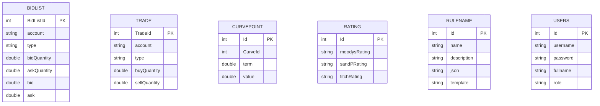

# Poseidon Capital Solutions

Application web interne développée pour **Poseidon Conseils – Division Trésorerie**.

L'application centralise la gestion des données financières utilisées par les différents outils de l'agrégateur financier de l'entreprise. Elle permet la gestion sécurisée des entités métier via une interface web basée sur Spring Boot et Thymeleaf.

---

## Modèle Physique de Données (MPD)



---

## Fonctionnalités

L'application permet la gestion complète (CRUD) des entités suivantes :

| Entité     | Description                            |
| ---------- | -------------------------------------- |
| BidList    | Cotations financières (Bid / Ask)      |
| Trade      | Transactions d'achat et de vente       |
| CurvePoint | Points de courbe de taux               |
| Rating     | Notations de crédit                    |
| RuleName   | Règles métier et paramètres techniques |
| User       | Gestion des utilisateurs et des rôles  |

### Validation des données

Les validations sont effectuées côté serveur :

* Champs obligatoires
* Valeurs numériques positives
* Validation des quantités et montants
* Validation des mots de passe :

   * Minimum 8 caractères
   * Au moins une majuscule
   * Au moins un chiffre
   * Au moins un caractère spécial

---

## Stack technique

* Java 17
* Spring Boot 3.1.12
* Spring Data JPA / Hibernate
* Spring Security
* Thymeleaf
* MySQL
* H2 Database (tests)
* Lombok
* Maven
* JUnit 5
* Mockito
* JaCoCo

---

## Prérequis

* Java 17
* Maven 3.8+
* MySQL 8+

---

## Installation

### 1. Cloner le projet

```bash
git clone https://github.com/votre-utilisateur/Poseiden-skeleton.git
cd Poseiden-skeleton
```

### 2. Créer la base de données

```sql
CREATE DATABASE demo;
```

### 3. Configurer les variables d'environnement

#### Windows PowerShell

```powershell
$env:DB_USERNAME="root"
$env:DB_PASSWORD="votre_mot_de_passe"
```

#### Linux / macOS

```bash
export DB_USERNAME=root
export DB_PASSWORD=votre_mot_de_passe
```

---

## Lancer l'application

### Profil développement

```bash
mvn spring-boot:run
```

L'application est accessible à l'adresse :

```text
http://localhost:8080
```

---

## Structure du projet

```text
src/
├── main/
│   ├── java/com/nnk/springboot/
│   │   ├── controllers/
│   │   │   ├── BidListController.java
│   │   │   ├── CurvePointController.java
│   │   │   ├── RatingController.java
│   │   │   ├── RuleNameController.java
│   │   │   ├── TradeController.java
│   │   │   ├── UserController.java
│   │   │   └── LoginController.java
│   │   ├── domain/
│   │   │   ├── BidList.java
│   │   │   ├── CurvePoint.java
│   │   │   ├── Rating.java
│   │   │   ├── RuleName.java
│   │   │   ├── Trade.java
│   │   │   └── User.java
│   │   ├── exceptions/
│   │   │   ├── EntityNotFoundException.java
│   │   │   └── GlobalExceptionHandler.java
│   │   ├── repositories/
│   │   │   ├── BidListRepository.java
│   │   │   ├── CurvePointRepository.java
│   │   │   ├── RatingRepository.java
│   │   │   ├── RuleNameRepository.java
│   │   │   ├── TradeRepository.java
│   │   │   └── UserRepository.java
│   │   ├── security/
│   │   │   ├── SecurityConfig.java
│   │   │   └── CustomUserDetailsService.java
│   │   ├── services/
│   │   └── Application.java
│   └── resources/
│       ├── static/css/
│       ├── templates/
│       ├── application.properties
│       └── application-prod.properties
└── test/
    └── java/com/nnk/springboot/
        ├── controllers/
        ├── services/
        ├── security/
        └── ApplicationTests.java
```

---

## Sécurité

L'application utilise **Spring Security** avec une authentification **session-based**.

### Fonctionnalités de sécurité

* Authentification par formulaire
* Gestion des utilisateurs depuis la base de données
* Mots de passe chiffrés avec BCrypt
* Protection CSRF activée
* Protection contre la fixation de session
* Une seule session active par utilisateur
* Déconnexion sécurisée avec invalidation de session
* Gestion des rôles utilisateur

### Routes publiques

```text
/app/login
/css/**
```

Toutes les autres routes nécessitent une authentification.

---

## Comptes de démonstration

Les comptes suivants sont présents dans le script SQL fourni :

| Utilisateur | Rôle  |
| ----------- | ----- |
| admin       | ADMIN |
| user        | USER  |

> Les mots de passe sont stockés sous forme de hash BCrypt.

---

## Tests

Exécution des tests :

```bash
mvn clean test
```

Les tests utilisent une base **H2 en mémoire** et n'impactent jamais la base MySQL.

### Couverture JaCoCo

Génération du rapport :

```bash
mvn clean verify
```

Rapport HTML :

```text
target/site/jacoco/index.html
```

---

## Sauvegarde de la base de données

### Sauvegarde

```bash
mysqldump -u root -p demo > backup_demo.sql
```

### Restauration

```bash
mysql -u root -p demo < backup_demo.sql
```

---

## Auteur

Projet réalisé dans le cadre du parcours :

**Développeur d'Application Java**
OpenClassrooms

Projet : **Poseidon Capital Solutions**
